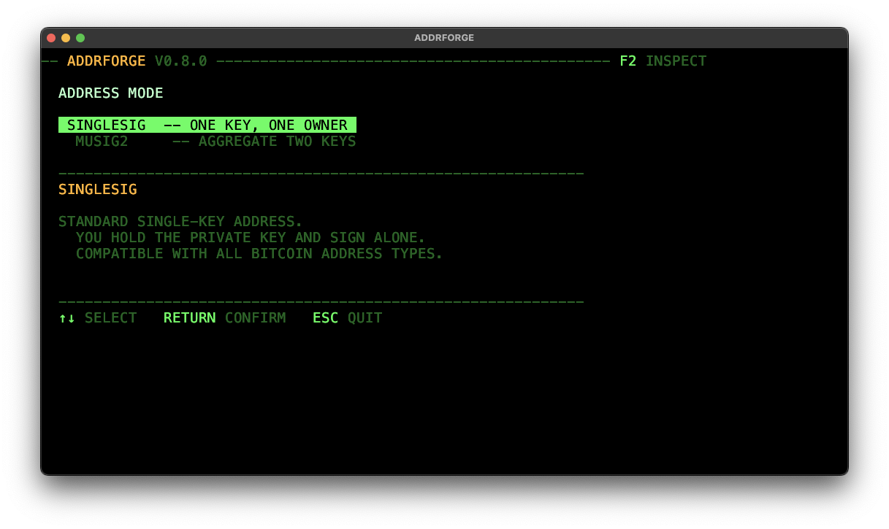
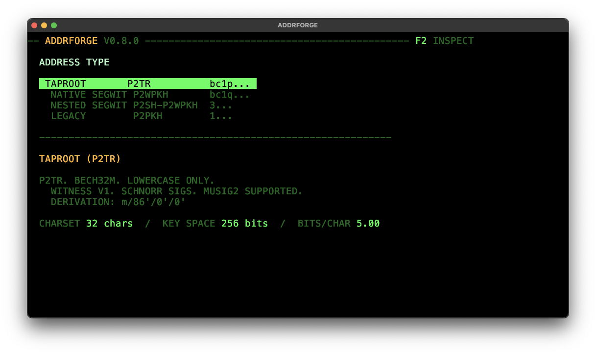
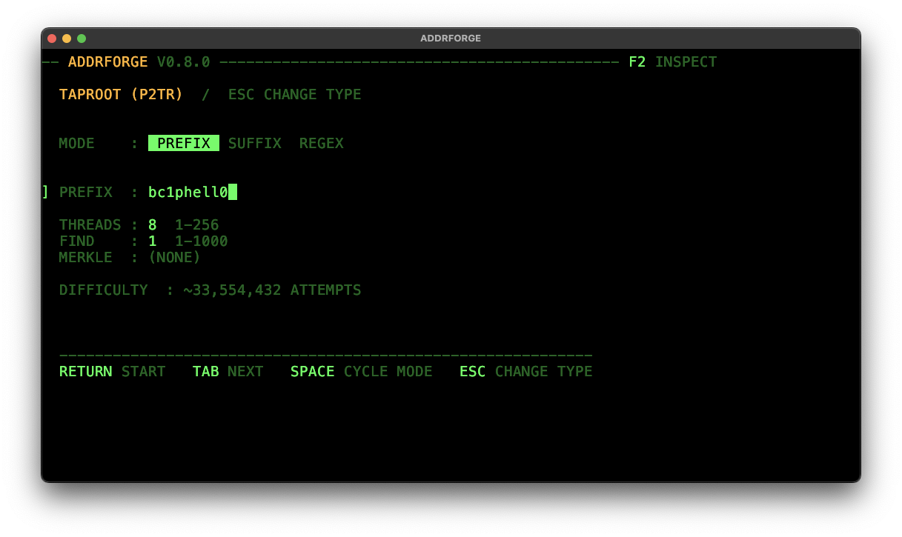
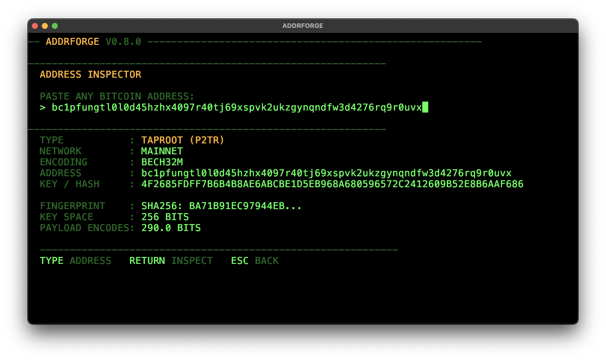

# addrforge

Bitcoin vanity address generator. Find addresses that start or end with a pattern you choose, or match a regular expression. Supports all four Bitcoin address types and MuSig2 two-of-two key aggregation.

```
bc1pcat     bc1qfat     1Dad     3Shop
```






---

## Build

```bash
cargo build --release
```

The binary is at `./target/release/addrforge`. Requires Rust 1.65+. Tested on Linux and macOS.

---

## TUI

Launch with no arguments to open the interactive terminal interface.

```bash
./target/release/addrforge
```

**Flow:**

```
Address Mode → Type Picker → Setup → Running → Results
                   ↓
              MuSig2 Setup → MuSig2 Result
```

| Key | Action |
|-----|--------|
| `↑↓` or `j/k` | Navigate |
| `Tab` / `Shift-Tab` | Next / previous field |
| `Space` | Cycle mode on MODE field |
| `Enter` | Confirm / start search |
| `Esc` | Back |
| `S` | Save results to file |
| `I` | Inspect selected address |
| `N` | New search (resets to start) |
| `F2` | Open address inspector from any screen |
| `Ctrl-C` | Quit |

---

## Address types

| Type | Prefix | Format | Derivation |
|------|--------|--------|------------|
| Taproot P2TR | `bc1p` | bech32m | m/86'/0'/0' |
| Native SegWit P2WPKH | `bc1q` | bech32 | m/84'/0'/0' |
| Nested SegWit P2SH-P2WPKH | `3` | base58 | m/49'/0'/0' |
| Legacy P2PKH | `1` | base58 | m/44'/0'/0' |

Bech32 addresses (Taproot, Native SegWit) are lowercase only. Base58 addresses (Legacy, Nested) are case-sensitive — `1ABC` and `1abc` are different patterns.

---

## Search modes

**PREFIX** — address starts with your pattern (after the fixed type prefix).

```
Pattern: bc1pface
Finds:   bc1pface8qx3...
```

**SUFFIX** — address ends with your pattern.

```
Pattern: dead
Finds:   bc1p...dead
```

**REGEX** — full regular expression match against the complete address string.

```
Pattern: ^bc1p[0-9]{4}
Finds:   bc1p1337...
```

Difficulty scales exponentially with pattern length. Each extra character multiplies search time by 32 (bech32) or 58 (base58). A 4-character Taproot vanity suffix takes ~1 million attempts on average; 8 characters takes ~1 trillion.

Use `--bench` to measure your machine's generation rate before committing to a long search.

---

## MuSig2

MuSig2 mode derives a two-of-two aggregate Taproot address from two compressed public keys. Both parties must co-sign to spend. The resulting address is indistinguishable from a single-key Taproot address on-chain.

**Input format:** 33-byte compressed public keys, 66 hex characters, with `02` or `03` prefix. Keys from any wallet type (Legacy, SegWit, Taproot) work — the output is always a Taproot address.

**Important:** The key shown on the singlesig results screen labeled *OUTPUT KEY (TWEAKED X-ONLY PUBKEY)* is **not** the right format for MuSig2. Use the *COMPRESSED PUBKEY* row shown below it, or provide keys generated externally by your wallet software.

**This is not a signing tool.** addrforge derives the address only. To actually spend from a MuSig2 address you need a BIP-327 compatible signing library or wallet.

---

## CLI (no TUI)

```bash
# Find one Taproot prefix address
./target/release/addrforge --no-tui --pattern bc1pface

# Find 5 legacy addresses ending in 'cafe'
./target/release/addrforge --no-tui --addr-type legacy --mode suffix --pattern cafe --count 5

# Regex search, 8 threads
./target/release/addrforge --no-tui --mode regex --pattern "^bc1p[0-9]{3}" --threads 8

# Save results to a specific directory
./target/release/addrforge --no-tui --pattern bc1ptest --output-dir ~/keys
```

**Flags:**

| Flag | Default | Description |
|------|---------|-------------|
| `--no-tui` | — | Print results to stdout instead of TUI |
| `--addr-type` | `taproot` | `legacy`, `nested`, `native`, `taproot` |
| `--mode` | `prefix` | `prefix`, `suffix`, `regex` |
| `--pattern` | — | Pattern to search for (required with `--no-tui`) |
| `--count` | `1` | Number of matches to find |
| `--threads` | all CPUs | Number of worker threads |
| `--output-dir` | `.` | Directory for saved result files |
| `--bench` | — | Benchmark generation speed and exit |

---

## Benchmark

```bash
# Taproot speed on all CPUs
./target/release/addrforge --bench

# Legacy speed on 4 threads
./target/release/addrforge --bench --addr-type legacy --threads 4
```

Prints addresses/sec and estimated average search time per prefix length. Runs for 5 seconds then exits.

---

## Output files

Saved results are written to `addrforge-<timestamp>.txt` in the output directory. MuSig2 derivations are saved as `addrforge-musig2-<timestamp>.txt`.

Example singlesig result file:

```
ADDRFORGE V0.8.0 -- RESULTS
TYPE    : TAPROOT (P2TR)
MODE    : PREFIX
PATTERN : bc1pface
THREADS : 8  COUNT : 1
ELAPSED : 4.2S  ATTEMPTS : 3,847,201

MATCH 1
  ADDRESS    : bc1pface8qx3...
  PUBKEY     : <x-only output key>
  COMPRESSED : 02<compressed pubkey — use this for MuSig2>
  WIF KEY    : <private key in WIF format>
```

---

## Importing keys into a wallet

The WIF private key from addrforge works with any Bitcoin wallet that supports raw key import, but most wallets need to know which address type to derive. The same private key can produce all four address types.

**Sparrow Wallet** — recommended for all address types, especially Taproot.

1. File → New Wallet → Private Key
2. Paste the WIF key
3. Select the script type (P2TR for Taproot, P2WPKH for Native SegWit, etc.)

Sparrow also supports descriptor import:

```
tr(KwDiB...)
```

**Bitcoin Core** — works via the console with descriptors:

```
importdescriptors [{"desc":"tr(KwDiB...)#checksum","timestamp":"now"}]
```

Run `getdescriptorinfo "tr(KwDiB...)"` first to get the checksum.

**Electrum** — requires a script-type prefix when importing:

| Prefix | Address type |
|--------|-------------|
| `p2tr:KwDiB...` | Taproot (bc1p) | *Not Supported
| `p2wpkh:KwDiB...` | Native SegWit (bc1q) |
| `p2wpkh-p2sh:KwDiB...` | Nested SegWit (3) |
| `p2pkh:KwDiB...` | Legacy (1) |

Without a prefix, Electrum defaults to Legacy.

**Wallets that do NOT support Taproot WIF import:** BlueWallet, Trust Wallet, Exodus, and Wasabi (expects seed phrases only) generally cannot import raw Taproot keys even if they support Taproot addresses.

---

## Security

**The WIF private key in the output file controls the funds.** Anyone with access to this file can spend from the address.

- Store result files in an encrypted location immediately after saving
- Never share WIF keys or commit them to version control
- For significant funds, generate keys on an air-gapped machine
- addrforge generates keys using the OS cryptographic RNG (`thread_rng` backed by the system entropy source)
- Vanity prefixes do not meaningfully reduce security — even an 8-character Taproot prefix leaves 216 bits of key space, far beyond any feasible attack

---

## Taproot Merkle root

In the TUI setup screen, Taproot prefix and suffix searches expose an optional **MERKLE** field. If you provide a 32-byte (64 hex char) Taproot script tree root, the address will commit to that script tree. Leave blank for a standard key-path-only address.

---

## Address inspector

Press `F2` from any main screen, or `I` on the results screen, to open the address inspector. Paste any Bitcoin address to decode its type, network, encoding, key hash, and spend type. Works with mainnet, testnet, signet, and regtest addresses. The inspector detects provably unspendable addresses using the BIP-341 NUMS point.